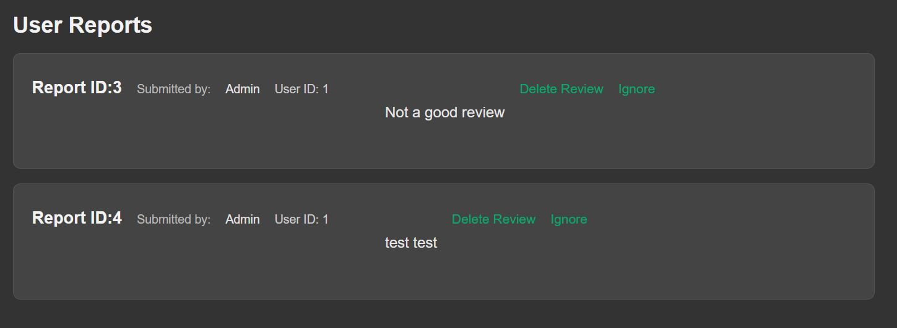
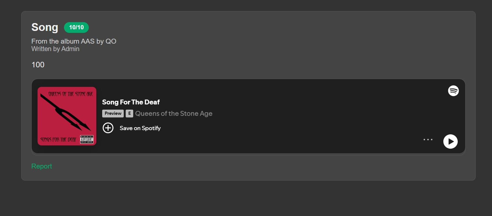
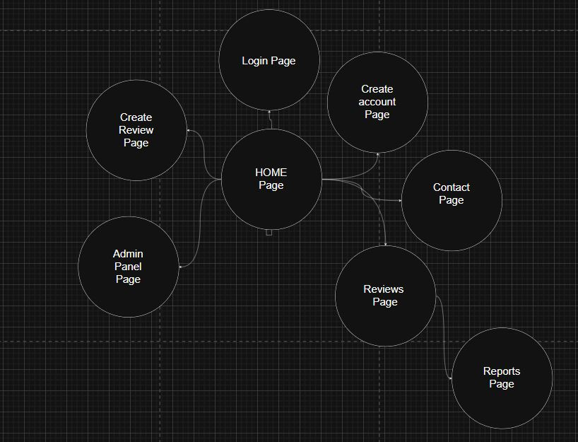

# Open Music Review

# Deployment
A link to my [Repository](https://github.com/Majorkas/open-music-review) for the project and then

The Website is hosted on Render [here](https://open-music-review.onrender.com).

For my deployment, I used Render.com to host the Flask application. I chose Render because it offers a straightforward way to deploy web applications with minimal configuration. It supports Python and Flask out of the box, making it easy to get my project website up and running quickly. 

I also utilized a PostgreSQL database provided by Render to store user information and reviews. The integration between Flask and PostgreSQL was seamless.

Creating and deploying is as simple as creating the db on Render, linking the GitHub repository, and setting the external db URL in your environment variables for database connection. One of the only problems with the Free version of the Db is that it only last for a month before needing to be recreated, but thankfully Render makes this process easy the only thing you have to do is create the new db and update the ENV variable to the new db URL.


## Overview
A music review website built for anyone to leave honest reviews on music they've found or listen to, helping others discover new tunes and artists. I decided to build this project in particular because I love music and I love discovering new music, so I wanted to create a platform where people could share their thoughts on different albums, songs, and artists.

### Page by Page Breakdown

- **Home Page**: The landing page that welcomes users and provides navigation to other sections of the site.
- **Register Page**: A page where new users can create an account by providing a username, email, and password.
- **Login Page**: A page for existing users to log in using their credentials.
- **Submit Review Page**: A form where logged-in users can submit reviews for songs including a title, content, score, and a Spotify link.
- **Reviews Page**: A page that displays all submitted reviews.
- **Admin View Page**: A restricted page for admin users to manage user roles and oversee site content.
- **Contact Page**: A page providing a form for users to reach out with questions or feedback.
- **Report Page**: A page where users can report inappropriate reviews or behavior.

### Standout Features

On the model side of things, I implemented user authentication using Flask-Login, allowing users to register, log in, and manage their sessions securely. Passwords are hashed using Werkzeug's security module to ensure user data protection. 

```python 
def hash_password(self, unhashed_password: str):
        '''hashes password for storage to db'''
        self.password = generate_password_hash(unhashed_password)


    def validate_password(self, unhashed_password: str):
        '''Function to check the hashed password'''
        return check_password_hash(self.password, unhashed_password)
```

Admin functionality was also a key feature, enabling certain users to have elevated privileges for managing content and user roles. This was implemented by adding an 'admin' boolean field to the User model and creating routes that check for admin status before granting access.

```python
@app.route('/AdminView/EditPrivilages/<int:user_id>', methods=["POST"])
def edit_privilages(user_id):
    '''Action for editing a users privilages setting them to be an admin or making admins users again'''
    user = current_user
    if user.admin == False:
        flash("User Not Authorised")
        return redirect(url_for("index"))

    user = User.query.filter_by(id = user_id).first()
    privilages = request.form['admin']

    if privilages == "admin":
        user.make_admin() #type:ignore
    else:
        user.make_user() #type:ignore
    flash("Role Updated")
    return redirect(url_for("admin_page"))
```
Another important feature is the ability to embed Spotify links directly into reviews. This was achieved by parsing the provided Spotify URL to extract the necessary embed code, allowing users to listen to the song directly from the review page.
```python
def get_song_embed_code(self):
    '''
    takes the spotify link provided in the form cuts the song code out and inserts it into the embed link for use
    in the review display
    '''
    split = self.song_link.split("/")
    split = split[-1].split("?")
    code = split[0]
    return f"https://open.spotify.com/embed/track/{code}"
```
The website also includes a reporting system, enabling users to flag inappropriate content. This then can be reviewed by the admins and they can then decide to either remove the review or ignore the report.
- **Reports Example**:

- **Embedded Spotify Example**:


### Styling

The website features a clean and modern design, utilizing CSS for styling and layout. Responsive design principles were applied to ensure the site looks good on both desktop and mobile devices.

I kept the color scheme simple using a dark gray background and an almost neon Green to decorate but with a focus on usability, using contrasting colors for text and backgrounds to enhance readability. The navigation is intuitive, with clear links to different sections of the site.

I also used JavaScript to create an interactive menu for mobile users, allowing for a better user experience on smaller screens.

With styling not being the main focus of the prject I kept it as simple as possible but after the last project being marked down for the organisation of my code I made sure to put in a bit more effort this time around. labeling each section of the CSS file and grouping similar styles together to make it easier to read.

## Final Thoughts
Overall, building the Open Music Review website was a rewarding experience that allowed me to apply what I've learned in the last two modules. I'm proud of the final product and I had a lot of fun building it!

# site map
A simple site map showing the structure of the website and how the different pages are linked together.


